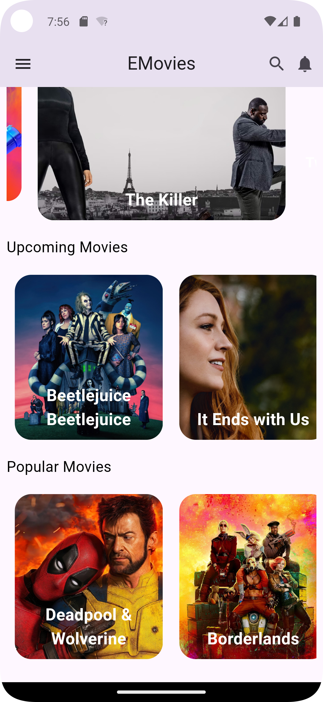

# e_movies_v1: 
## A Flutter App for Learning API Integration

### Introduction
This Flutter app, e_movies_v1, serves as a practical learning project for integrating APIs into Flutter applications. The app leverages the TMDB API to fetch and display movie data.

### Key Features
- API Integration: Seamlessly integrates the TMDB API to retrieve movie information.
- API Models: Utilizes Dart classes to represent movie data, ensuring a structured approach.
- User Interface: Provides a user-friendly interface for browsing and searching movies.

### Technologies
- Flutter: A cross-platform framework for building mobile applications.
- Dart: A client-optimized language for fast apps on any platform.
- TMDB API: A RESTful API for accessing movie data.

### Setup
1. Clone the repository.
2. Navigate to the project directory.
3. Run `flutter pub get` to install dependencies.
4. Create a TMDB account and obtain an API key.
5. Create a file named 'Keys/api_key.dart' at the lib directory.
6. Insert the API key in the 'api_key.dart' file as follows:
```
const tmdbApiKey = '******';
```
7. Run the app using `flutter run`.

### Conclusion
e_movies_v1 demonstrates the process of integrating APIs into Flutter applications. By following the project, you can learn how to fetch and display data from external sources in your Flutter projects.

### Screenshots

